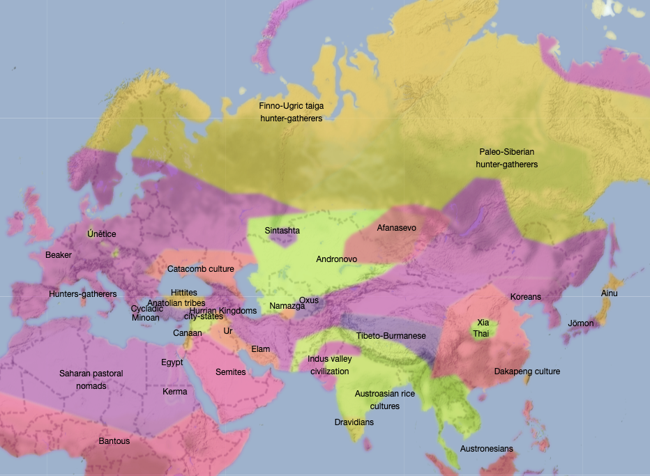
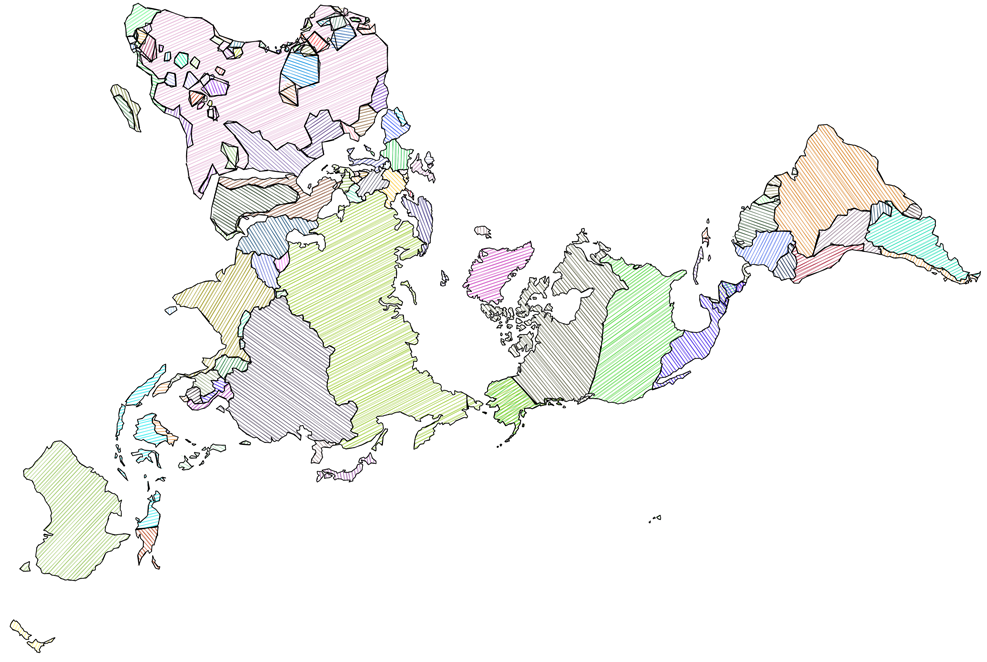
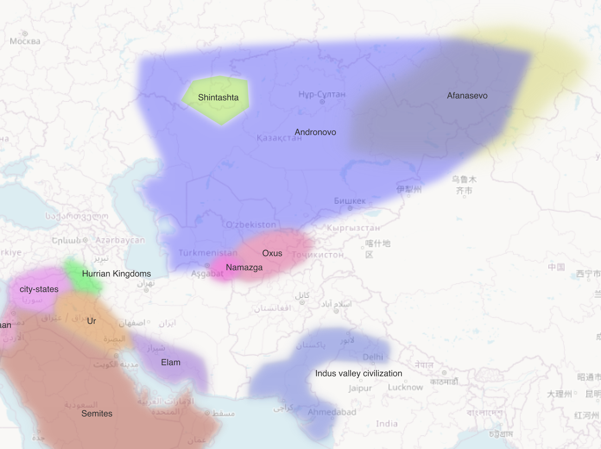
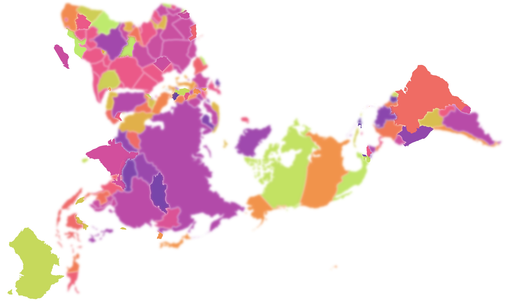
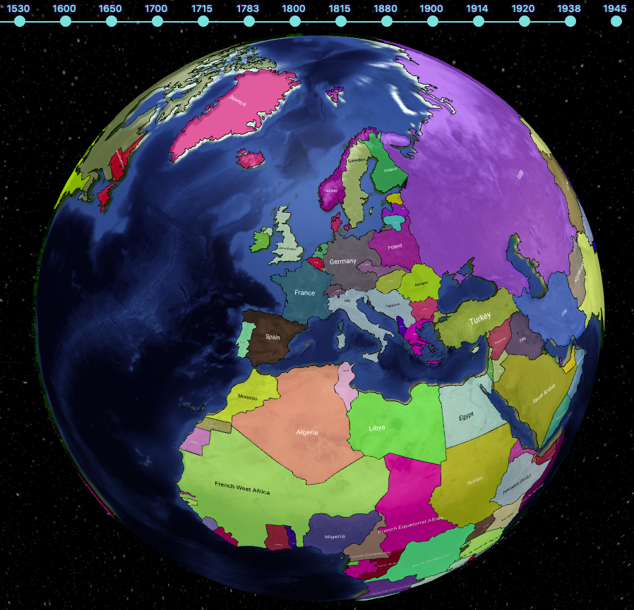

# Historical boundaries of world countries and cultural regions

This historical boundaries project aims at providing ready-to-use base maps for mapping historical data. As a vast, epoch-specific historical knowledge is required to make these files more reliable, this project is open to all contributions. Please consider that this is __work in progress__. Do not hesitate to fork this repository, report issues, and file [git pull requests](https://docs.github.com/en/github/collaborating-with-pull-requests/proposing-changes-to-your-work-with-pull-requests/creating-a-pull-request-from-a-fork). Further notes on contributing in [CONTRIBUTING.md](CONTRIBUTING.md).

A [web app for exploring this data](https://historicborders.app/) has been created by Adam (GitHub user _ngrapple_).

You'll find other [use examples with D3 and Leaflet](https://ourednik.info/historicalmaps/) on ourednik.info.

## GeoJSON

All maps are stored in the [_geojson_](https://github.com/aourednik/historical-basemaps/tree/master/geojson) format: single file per feature layer, human and machine readable, easy to import in [qGIS](https://github.com/qgis/QGIS) or use in [D3](https://github.com/d3) (see [d3v5_example.html](https://github.com/aourednik/historical-basemaps/tree/master/d3v5_example.html) as well as [d3v5_roughjs_example.html](https://github.com/aourednik/historical-basemaps/tree/master/d3v5_roughjs_example.html) with the additional use of [rough.js](https://github.com/pshihn/rough)). [Integration in Leaflet](https://ourednik.info/historicalmaps/leafletExample), OpenLayers et al. is also easy to achieve.

Geocoding precision is adapted for mapping data on world/continent scale. The following fields are available in every file:

* __NAME__: the name of the country or region; ideal for text labels
* __SUBJECTO__: the name of the colonial power exercising authority on the country or region; the name of the region otherwise; ideal for choropleth colors

The file called [_places.geojson_](https://github.com/aourednik/historical-basemaps/tree/master/places.geojson) contains locations of cities and other settlements. At this point, it is only a draft and needs your help for completion. Places throughout history can be added to this single file. When used, it can be filtered  time fields:

* __name__: the toponym
* __inhabitedSince__: inhabited since
* __inhabitedUntil__: inhabited until, or NULL if it still is.

## SVG

The [SVG maps](https://github.com/aourednik/historical-basemaps/tree/master/svg/) are the result of a conversion of GeoJSON files with the R script [_geojson2svg.Rmd_](https://github.com/aourednik/historical-basemaps/tree/master/geojson2svg.Rmd). The script uses a "Natural Earth" projection.

Please see these SVG files only as raw material editable with a vector drawing software for the needs of GIS-unsavvy users. If you contribute to this Git repository, please edit directly the GeoJSON files.

## Conceptual limitations and disputed territories

When using the data, keep in mind that

1. historical boundaries are even more disputed than contemporary ones, that
2. the actual concept of territory and national boundary becomes meaningful, in Europe, only since the [Peace of Westphalia](https://en.wikipedia.org/wiki/Peace_of_Westphalia) (1648), that
3. areas of civilizations actually overlap, especially in ancient history, and that
4. overlaying these ancient vector maps on contemporary physical maps can be misleading; rivers, lakes, shorelines _do_ change very much over millennia; think for instance about the evolution of the [Aral Sea](https://en.wikipedia.org/wiki/Aral_Sea) since the 1980s.

Overlapping areas are usually dealt with as topological errors in traditional GIS, but some overlaps make sense in the case of this repository. Notwithstanding epistemological and historiographical concerns, the pragmatic bottom line is: vector GIS has points, polygons and lines. That's it. Nevertheless, _transparent layers_ (opacity < 100%) and _blur effects_ on rendering is a convenient way to deal with fuzzy borders of pre-modern societies.  

Visual distinction between precise and approximate borders can also be achieved on the same map. See [this D3js example](https://ourednik.info/historicalmaps/d3v5_FuzzyAndExactBorders_example.html).

## Projection

The geodata are stored in the WGS 84 projection, EPSG:4326 (crs:OGC:1.3:CRS84). Coordinates are in LatLon, the projection is geographical. Consider reprojecting to show the maps on world scale, choosing a [projection with minimal area distortion](https://bl.ocks.org/syntagmatic/ba569633d51ebec6ec6e), such as the __Dymaxion__ (AirOcean) projection or the __Molweide__ projection. Most mapping software and algorithms reproject on the fly. Globe wrapping is also possible, [as illustrates ngrapples's app](https://historicborders.app/?view=globe):

## Contributing

You are welcome to contribute by making your forks and filing git pull requests. Further notes on contributing in [CONTRIBUTING.md](CONTRIBUTING.md).

## Credits

This project started as a collection of basemaps collected, adapted and converted from diverse sources, sometimes only available through the wayback machine. Among these sources, anonymous students from the "ThinkQuest Team C006628".

## Some (rare) historical GIS resources on the web

* [GIS data : historical country boundaries](https://www.gislounge.com/find-gis-data-historical-country-boundaries/)
* [CShapes by Niels Weidman](http://nils.weidmann.ws/projects/cshapes.html), also available as an R package.
* [Ancient World Mapping Center at the University of North Carolina](http://awmc.unc.edu/wordpress/map-files/)
* [Geacron.com](http://geacron.com). A nice tool, but commercial, with no possibility to extract polygons for use in a GIS.
* [Atlas of Human Evolution](http://atlasofhumanevolution.com/). A very nice tool, for the prehistory of the Homo species.
* [Old Maps Online](https://www.oldmapsonline.org/en/Hokkaido).
* [Native Land](https://native-land.ca). Contains notably maps of territorial conventions between colonizers and native populations in the Americas and Australia.
* [Euratlas.net](https://www.euratlas.net/history/europe/)

## Other resources - non-GIS or GIS files non-downloadable

* [Wikimedia: Maps of the world showing history](https://commons.wikimedia.org/wiki/Category:Maps_of_the_world_showing_history)
* [Interactive World History Atlas since 3000 BC](http://geacron.com/home-en/). The commercial version of the program allows you to see the timeline.

## Spatial mutations in theory and fiction published by the curator of this repository

* [Ourednik, A. (2019) _Hypertopie: de l'utopie à l'omniscience_, La Baconnière.](https://ourednik.info/en/textes/hypertopie) (essay, in French) - on the notion of _hypertopia_, comprising the "impossible here" of locallist utopias and the collapse of contemporary space into an infinite _hit et nunc_.

* [Ourednik, A. (2014), _The impossible here_](https://www.espacestemps.net/articles/the-impossible-here/) (research paper) - "Grain upon grain, one by one, and one day, suddenly, there’s a heap, a little heap, the impossible heap."

* [Ourednik, A. (2015) _Les cartes du boyard Kraïenski_](https://ourednik.info/en/textes/boyard-kraienski) (novel, in French) -  a cartographer sent to map the eastern border or the European Union gets lost in a fictive country somewhere between Ukraine and Bulgaria...

* [Ourednik, A. (2010) _L'habitant et la cohabitation dans les modèles de l'espace habité_ (2010), EPFL.](https://ourednik.info/essais.php?texte=phd) (PhD thesis, in French) - on the notion of codwelling in space and time. Central topic: changing spatial ontologies (_i.e._ the type and extent of things in space).
