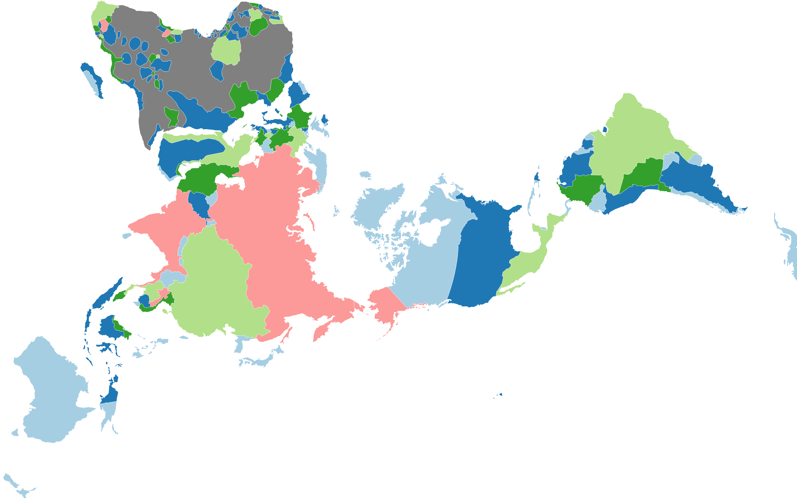

# Historical boundaries of world countries and cultural regions

This historical boundaries project aims at providing ready-to-use base maps for mapping historical data.

All maps are stored in the geojson format: single file per feature layer, human and machine readable, easy to import in [qGIS](https://github.com/qgis/QGIS) or use in [D3](https://github.com/d3) (see [d3example.html](d3example.html) written for D3v4 and [d3v5example.html](d3v5example.html) for D3v5, as well as [d3v5_roughjs_example.html](d3v5_roughjs_example.html) with the additional use of [rough.js](https://github.com/pshihn/rough)).

Geodata precision and generalization is adapted for mapping data on the scale of a continent or of the whole world.

## Conceptual limitations

When using the data, keep in mind that

1. historical boundaries are even more disputed than contemporary ones, that
2. the actual concept of territory and national boundary becomes meaningful, in Europe, only since the [Peace of Westphalia](https://en.wikipedia.org/wiki/Peace_of_Westphalia) (1648), that
3. areas of civilizations actually overlap, especially in ancient history, and that
4. overlaying these ancient vector maps on contemporary physical maps can be misleading; rivers, lakes, shorelines _do_ change very much over millenia; think for instance about the evolution of the [Aral sea](https://en.wikipedia.org/wiki/Aral_Sea) since the 1980s.

Finally, note that overlapping areas are useally dealt with as topological errors in traditional GIS. Fuzzy borders are difficult to handle. Certainly a field to investigate...

## Projection

The geodata are stored in the WGS 84 projection, EPSG:4326 (crs:OGC:1.3:CRS84). Coordinates are in LatLon, the projection is geographical. Consider reprojecting to show the maps on world scale, choosing a [projection with minimal area distortion](https://bl.ocks.org/syntagmatic/ba569633d51ebec6ec6e), such as the __Dymaxion__ projection in the first example or the __Molweide__ projection. Most mapping software and algorithms reproject on the fly.

## Contributing

When correcting individual geojson files, please make sure that boundaries remain aligned over all files. The multilayer topological editing tool in QGIS 3 might help you with that. Further notes on contributing in [CONTRIBUTING.md](CONTRIBUTING.md)

## Credits

This project started as a collection of basemaps collected, adpated and converted from diverse sources, sometimes only available through the wayback machine. Among these sources, anonymous students from the "ThinkQuest Team C006628".

## Some (rare) historical GIS resources on the web

* [GIS data : historical country boundaries](https://www.gislounge.com/find-gis-data-historical-country-boundaries/)
* [CShapes by Niels Weidman](http://nils.weidmann.ws/projects/cshapes.html), also available as an R package.
* [Ancient World Mapping Center at the University of orth Carolina](http://awmc.unc.edu/wordpress/map-files/)

## Other resources - non-GIS or GIS files non-downladable

* [Wikimedia: Maps of the world showing history](https://commons.wikimedia.org/wiki/Category:Maps_of_the_world_showing_history)
* [Interactive World History Atlas since 3000 BC](http://geacron.com/home-en/). The commercial version of the program allows you to see the timeline.

## Spatial mutations in theory and fiction

* [Ourednik, A. (2010) _L'habitant et la cohabitation dans les modèles de l'espace habité_ (2010), EPFL.](https://ourednik.info/essais.php?texte=phd) (PhD thesis, in French) - on the notion of codwelling in space and time. Central topic: changing spatial ontologies (_i.e._ the type and extent of things in space).

* [Ourednik, A. (2014), _The impossible here_](https://www.espacestemps.net/articles/the-impossible-here/) (research paper) - "Grain upon grain, one by one, and one day, suddenly, there’s a heap, a little heap, the impossible heap."

* [Ourednik, A. (2015) _Les cartes du boyard Kraïenski_](https://ourednik.info/fictions.php?texte=boyard-kraienski) (novel, in French) -  a cartographer sent to map the eastern border or the European Union gets lost in a fictive country somewhere between Ukraine and Bulgaria...

If you edit the geojson maps and want to refer your own published work, please add here.
